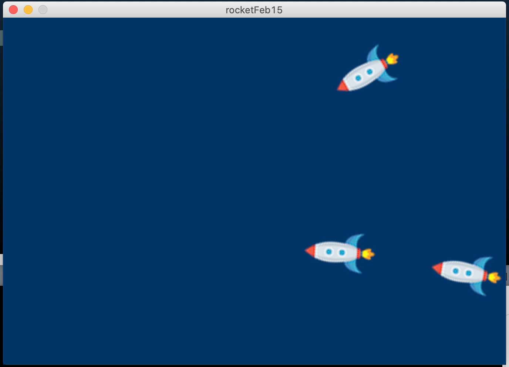

# README

## This is the documentation for February 15th assignment.

For this week's project, I have updated my rocket from a simple yellow rectangle to an upgraded spaceship that looks awesome on the dark blue background (thanks to @classmates for inspiration!).

The final sketch with the force field and an array list of rockets looks like this:

I have started off by creating a rocket sketch last week, adding keyboard PVector manipulation for change in location, velocity, and acceleration. Instead of copying the classroom code, I have created my own because I was not feeling super confident and wanted to get more practice with PVectors.

For the new version of the sketch, I have created a flowField Class that creates a Perlin Noise field in a 2D PVector array. My main guidance was Dan Shiffman's The Nature of Code (Chapter 6). In this class, there is a PVector method called lookup() that returns the location for the rocket to follow. In the Mover Class that contains my rocket object, there is a method that calls lookup() and applies the steering force to the rocket to move with the direction of the field.

My main challenge when implementing this code was understanding the physics behind the steering force and the flow field. It is still not really intuitive for me, but from what I understand, the flowField creates tiny vectors as a 2D array field that my rocket "looks up". After that, a desired location is acted by the steer force for the rocket to "find" the flow and move with it.

As this production assignment is not final yet, I will go back to the Nature of Code YouTube playlist to rewatch how the steer force and flow fields work for the code to be more intuitive to me.
