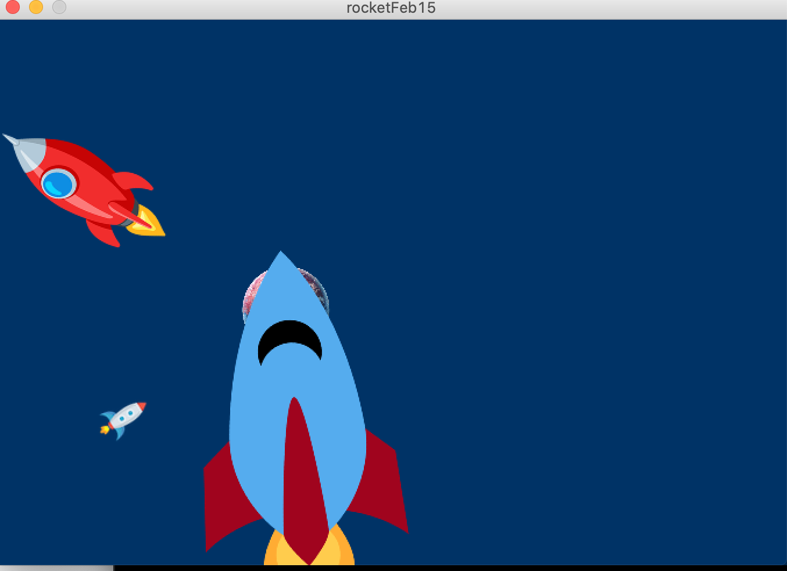
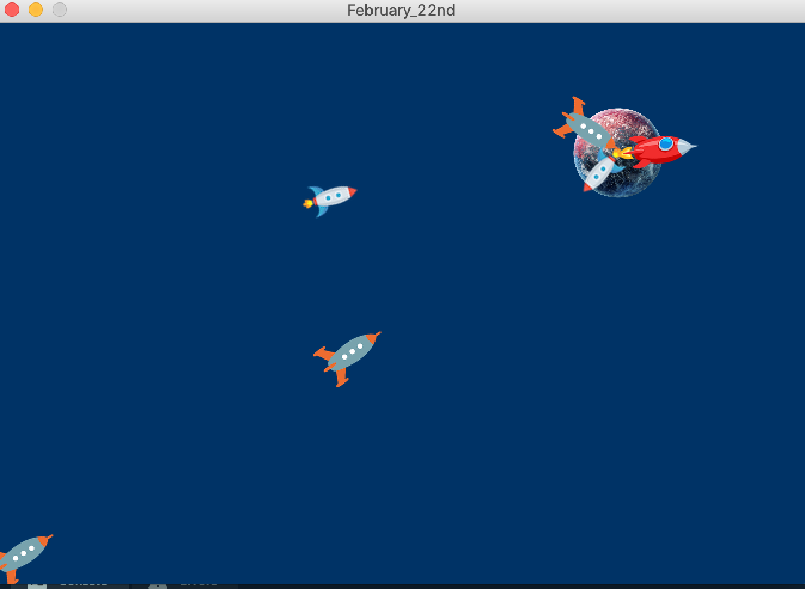

## February 22nd
# README

In this version of my rocket vehicle(s), I have created and modified several classes to make a complex movement system in Outer Space.

- Mover Class:

Here, I have modified all of the force functions to return a PVector instead of applying the force direcctly. I then have created a void function called applyBehavior() that accepts all of the returned forces and applies them. Each rocket now has its own mass, individual image, maximum velocity, and maximum force. These individual objects are decided in the DNA Class, which I will talk about below.

- DNA Class:

This Class decides how each of the rockets will behave. Based on randomness, it chooses one of the four images for each rocket to have, as well as all of their individual parameters. Each parameter is returned to the Mover object when the respective functions are called.

- Planet Class:

In this Planet Class there is an object that displays as a red planet. There is a method that returns the planet location which gets called when the Mover class objects are seeking and arriving at the particular location (to this planet).

- Selection and Survival:

To check for the selection and rocket survival, I have created a boolean method inside the Mover class that checks how far the rocket is from the planet. If the rocket is fast enough to arrive, there will be a child rocket born at a specific location on canvas. I am curious to see if some of the parent rocket parameters can be passed into the child rocket for the selection, survival, and evolution to look more real.

Some of the challenges encountered was working on the DNA class to choose the "uniqueness" of each rocket. It took some creative power to come up with the individual parameters and decide how they will be passed into the Mover. Another challenge was to simulate the selection and survival, as I have only came up with a way to breed rockets and not "kill" them.

Here is how the program looks like:

