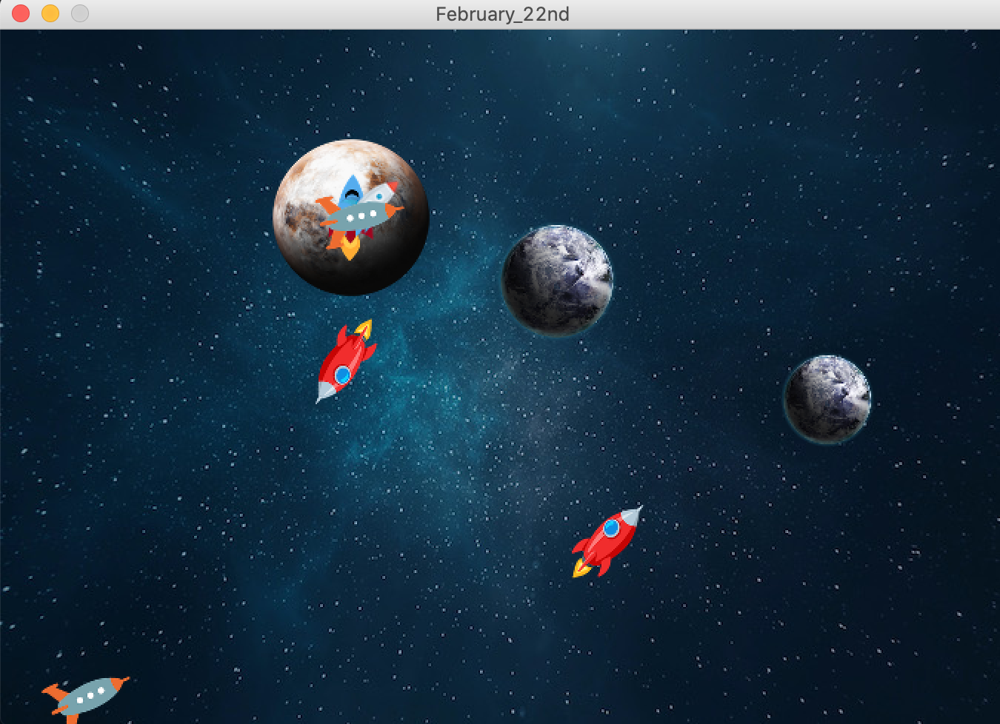

Woohoo! New sketch - more updates...

# March 1. Rockets are still alive.

On a more serious note, one of the new features for this week's production is ... rocket fuel! Every frame, the rocket's manipulations take out a certain amount of fuel for movement and force applications. If the amount of fuel is below 5, the rocket dies. However, if the rocket is on the Earth, the fuel is topped up and more rockets are born.

Another important update is new graphics. I have created a new space background for the sketch so that the application looks more realistic.

Planets have changed, too. I have updated the Planet class to hold a PImage array of planets and assigned each planet its individual location and size. The plan is to have each rocket come to a specific planet. For now all of my rockets are "seeking" and "arriving" to only one specific planet - I want to change this. I also would like to implement a method that separates planets, so that they are not stacked upon each other. I am having a challenge manipulating the Planet Class, but I think should I have more time in the future, I will make it work.

The DNA class works as expected and makes new rockets have their relatives' DNA. The replication and deletion of rockets also works well.

That's it!

